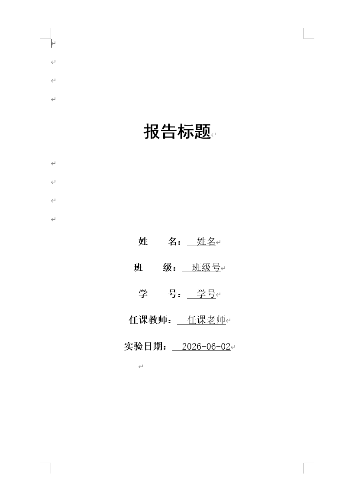
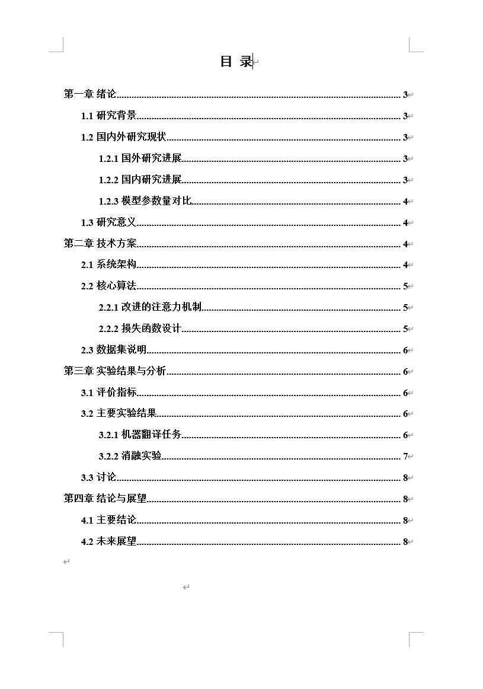
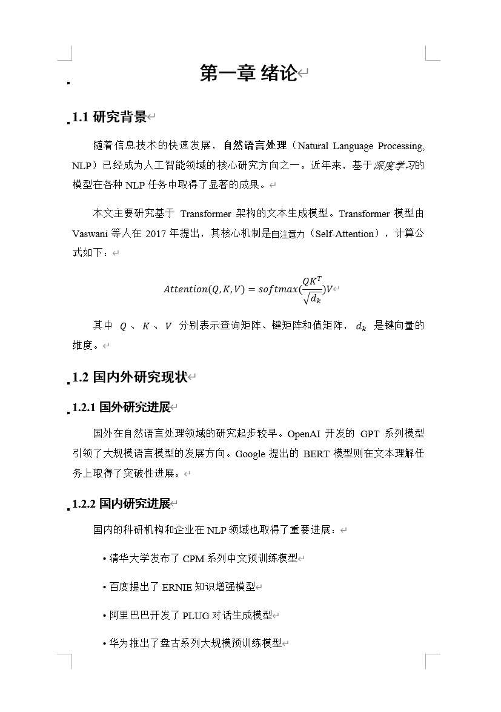
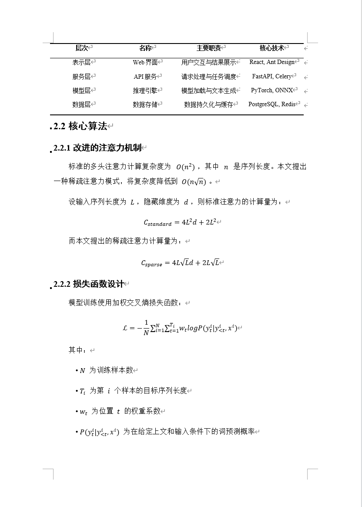

<p align="center">
  <h1 align="center">📄 md2docx</h1>
  <p align="center"><strong>Markdown → DOCX</strong> · 学术风格 · 样式可定制</p>
</p>

<p align="center">
  
  
  
</p>

---

**md2docx** 是一款命令行工具，将 Markdown 文件一键转换为符合学术规范、样式高度可定制的 Word（`.docx`）文档。适合撰写实验报告、课程论文、读书笔记等场景。

### 🤔 为什么不用 Pandoc / Agent+Skill？

| 方案 | 痛点 | md2docx |
|------|------|---------------|
| **Pandoc** | 默认样式粗糙，需要 reference docx；三线表、首行缩进等中文学术规范需大量定制；实际效果欠佳 | YAML 配置驱动，开箱即用：三线表、首行缩进、中英双字体等 |
| **Agent+Skill** | 结果不确定，每次输出可能不同；依赖网络和 API；长文档 token 成本高；隐私内容不宜上传；数学公式转换效果不佳 | 确定性转换；纯本地运行，零网络依赖，零成本，隐私安全；数学公式完美转换 |

## 🖼️ 效果预览

> 以下为 [example/sample.md](example/sample.md) 的转换效果。

<p align="center">
  
  
</p>

<p align="center">
  
  
</p>

## ✨ 功能特性

| 特性 | 说明 |
|------|------|
| 📔 **封面** | （可选）可配置的报告标题、姓名、班级学号、指导教师、日期 |
| 📑 **目录** | （可选）自动插入 Word TOC 域，在 Word 中右键即可更新 |
| 📐 **多级标题** | H1–H6 映射为 Word 内置标题样式，各级字体/字号/加粗/对齐独立可配 |
| 📝 **正文排版** | **自定义**，默认中英文双字体（宋体 + Times New Roman）、单倍行距、首行缩进2字符、两端对齐 |
| 📊 **学术三线表** | GFM 表格 → 三线表（顶线 1.5pt、表头下线 0.75pt、底线 1.5pt），支持表格内公式 |
| 🖼️ **图片** | `` 自动居中嵌入，宽高自适应页面 |
| 📋 **列表** | 有序/无序列表，支持嵌套层级 |
| 🧮 **LaTeX 公式** | 行内 `$...$` 和块级 `$$...$$` 转换为 Word 原生 OMML 公式 |
| 💻 **代码块** | 带边框的代码框 + 等宽字体，每行独立段落 |
| 💬 **引用块** | 左侧竖线 + 楷体斜体 |
| ⚙️ **自然语言配置** | 用自然语言描述格式需求，让 AI 生成 YAML 配置文件，无需手写 |

## 📦 安装

### 环境要求

- **Python** ≥ 3.10（唯一硬性要求）
- 以下包管理器**任选其一**：pip / uv

### 方式一：让 Agent 自动安装

在 OpenCode、Claude Code、Cursor、Codex 等 AI 工具中输入：

```
根据 https://raw.githubusercontent.com/RockyrLiu/md2docx/main/AGENTS.md 帮我安装 md2docx
```

agent 会自行读取安装指引，克隆项目、安装依赖、复制 skill，全程无需手动操作。

### 方式二：pip

```bash
git clone https://github.com/RockyrLiu/md2docx.git && cd md2docx
pip install --editable .
```

### 方式三：uv

```bash
git clone https://github.com/RockyrLiu/md2docx.git && cd md2docx

# 全局安装
uv tool install --editable .

# 或仅项目内使用
uv sync
uv run md2docx example/sample.md
```

## 🚀 快速开始

```bash
# 1. 克隆并安装
git clone https://github.com/RockyrLiu/md2docx.git && cd md2docx
pip install --editable .            # 或 uv tool install --editable .

# 2. 生成配置文件模板
md2docx -ic example/config.yaml

# 3. 编辑配置文件（填入你的信息）
#    用任意编辑器修改 config.yaml 中的封面信息和样式

# 4. 转换
md2docx example/sample.md -c example/config.yaml

# 5. 查看输出
#    打开 example/sample.docx，在 Word 中右键目录 → 更新域
```

## ⚙️ 配置文件

默认从当前目录的 `config.yaml` 加载，可通过 `-c` 指定自定义路径。缺失的键会自动回退到内置默认值。

使用 `md2docx -ic` 可快速生成一份模板配置文件到当前目录（或通过 `md2docx -ic my.yaml` 指定路径）。

```yaml
# === 封面 ===
cover:
  enabled: true                   # 是否生成封面
  title: "报告标题"
  author: ""                      # 姓名
  class_info: ""                  # 班级
  student_id: ""                  # 学号
  teacher: ""                     # 指导教师
  date: ""                        # 日期，留空则使用当前日期

# === 目录 ===
toc:
  enabled: true
  level: 3                        # 包含 1-3 级标题

# === 样式（部分示例） ===
styles:
  body:                           # 正文
    font_name: "宋体"
    font_name_ascii: "Times New Roman"
    font_size: 12                 # 小四
    line_spacing: 1.0             # 单倍行距
    first_line_indent: 2          # 首行缩进（字符数）
    alignment: "justify"

  headings:                       # 标题（h1–h6 可逐级配置）
    h1:
      font_name: "黑体"
      font_size: 16               # 三号
      bold: true
      alignment: "center"
    h2:
      font_name: "黑体"
      font_size: 14               # 四号
      bold: true
      alignment: "center"

  table:                          # 表格
    font_name: "宋体"
    font_size: 10                 # 五号
    header_bold: true
    alignment: "center"

  list:                           # 列表
    font_name: "宋体"
    font_size: 12                 # 小四
    indent: 0                     # 列表整体左缩进（字符数）
    first_line_indent: 2          # 列表项首行缩进（字符数）

  code:                           # 代码块
    font_name: "Consolas"
    font_size: 10
    border_color: "999999"
    border_width: 0.75
    show_border: true

  blockquote:                     # 引用块
    font_name: "楷体"
    font_size: 12
    italic: true

  render_thematic_break: false     # 是否渲染 --- 分隔线（默认不渲染）

# === 页面设置 ===
page:
  size: "A4"
  margin_top: 2.54                # cm
  margin_bottom: 2.54
  margin_left: 3.18
  margin_right: 3.18
```

> 完整配置模板见 [md2docx/default_config.yaml](md2docx/default_config.yaml)，或通过 `md2docx -ic` 生成。

## 🗣️ 自然语言转换（全流程 AI 驱动）

> ⚠️ **注意**：md2docx 转换工具本身**完全离线运行**。但此 skill 需要借助 AI 助手（OpenCode、Claude Code、Codex 等）理解你的自然语言需求，**使用在线 LLM Agent 时需要联网**。

**手写 YAML 太麻烦？** 项目内置了 AI skill，一句话描述格式需求，skill 自动完成**生成配置 + 执行转换**全流程。

### 安装 skill

**方式一：Agent 自动安装（推荐）**

在 AI 工具中输入以下指令，Agent 会自动克隆仓库并安装：

```
根据 https://raw.githubusercontent.com/RockyrLiu/md2docx/main/AGENTS.md 帮我安装 md2docx skill
```

**方式二：运行安装脚本**

```bash
python scripts/install_skill.py              # 全局安装（所有已检测到的智能体）
python scripts/install_skill.py --project .  # 安装到当前项目
python scripts/install_skill.py --list       # 查看已检测的智能体
python scripts/install_skill.py --agent "Claude Code"  # 仅为指定智能体安装
python scripts/install_skill.py --agent "Claude Code" "Cursor / AGENTS.md"  # 多个智能体
python scripts/install_skill.py --dry-run    # 预览即将安装的位置
```

**方式三：手动安装**

将 `.agents/skills/md2docx/` 目录复制到对应智能体的 skills 目录下（`<name>/SKILL.md` 结构）：

| 智能体 | 全局路径 | 项目路径 |
|--------|----------|----------|
| Claude Code | `~/.claude/skills/md2docx/SKILL.md` | `.claude/skills/md2docx/SKILL.md` |
| OpenAI Codex | `~/.codex/skills/md2docx/SKILL.md` | `.codex/skills/md2docx/SKILL.md` |
| OpenCode | `~/.config/opencode/skills/md2docx/SKILL.md` | `.opencode/skills/md2docx/SKILL.md` |
| Cursor 等 | `~/.agents/skills/md2docx/SKILL.md` | `.agents/skills/md2docx/SKILL.md` |

### 使用

在 AI 工具中直接调用，用自然语言描述即可：

```
/md2docx 把 report.md 转成 Word，正文宋体小四1.5倍行距，封面标题改成"数字电路实验报告"，作者张三
```

skill 会自动：理解你的格式需求 → 生成 `config.yaml` → 执行 `md2docx` 命令 → 输出 `.docx` 文件。

## 📐 中文字号对照

| 字号 | pt | 典型用途 |
|------|-----|---------|
| 二号 | 22 | — |
| 三号 | 16 | 题目 (H1) |
| 四号 | 14 | 一级标题 (H2) |
| 小四 | 12 | 正文 / 其余级标题 (H3–H6) |
| 五号 | 10 | 表格 / 脚注 |

## 📝 支持的 Markdown 语法

| 元素 | 语法 | 渲染效果 |
|------|------|---------|
| 标题 | `# H1` ∼ `###### H6` | Word 内置标题样式 |
| 粗体 | `**text**` | 加粗 |
| 斜体 | `*text*` | 斜体 |
| 行内代码 | `` `code` `` | Consolas 等宽 |
| 图片 | `` | 居中嵌入（相对路径相对于 .md 文件） |
| 无序列表 | `- item` | 缩进 + 项目符号 |
| 有序列表 | `1. item` | 缩进 + 数字编号 |
| 表格 | GFM 表格 | 学术三线表 |
| 代码块 | ```` ```lang ```` | 带边框代码框 + 等宽字体，每行独立段落 |
| 引用 | `> quote` | 左侧竖线 + 楷体 |
| 分隔线 | `---` | 水平线（默认不渲染，可通过 `render_thematic_break` 开启） |
| 行内公式 | `$E=mc^2$` | OMML 原生公式 |
| 块级公式 | `$$\frac{a}{b}$$` | 居中 OMML 公式 |

## 🛠️ 技术栈

| 库 | 用途 |
|----|------|
| [python-docx](https://python-docx.readthedocs.io/) | DOCX 文档生成与样式管理 |
| [mistune](https://mistune.lepture.com/) | Markdown 解析为 AST |
| [latex2mathml](https://pypi.org/project/late2mathml/) | LaTeX → MathML 转换 |
| [lxml](https://lxml.de/) | OMML XML 构建与注入 |
| [Pillow](https://python-pillow.org/) | 图片尺寸读取 |
| [PyYAML](https://pyyaml.org/) | YAML 配置文件解析 |

## 📁 项目结构

```
md2docx/
├── pyproject.toml               # 项目元数据 & 依赖声明
├── requirements.txt             # pip 依赖列表
├── uv.lock                      # uv 依赖锁定文件
├── AGENTS.md                    # Agent 安装指引
├── .gitignore
├── .python-version
├── LICENSE.txt                  # MIT 许可证
├── README.md
├── assets/                      # 效果截图
│   ├── sample-cover.png
│   ├── sample-toc.png
│   ├── sample-body1.png
│   └── sample-body2.png
├── md2docx/                     # 核心包
│   ├── __init__.py
│   ├── cli.py                   # CLI 命令行入口
│   ├── config.py                # YAML 加载 & 配置数据类
│   ├── default_config.yaml      # 默认配置文件模板
│   ├── parser.py                # Markdown → AST
│   ├── styles.py                # Word 样式管理器
│   ├── math_handler.py          # LaTeX → OMML
│   └── builder.py               # 文档构建器（核心编排逻辑）
├── scripts/                     # 辅助脚本
│   └── install_skill.py         # Skill 安装脚本
├── .agents/                     # Agent skill 定义
│   └── skills/md2docx/
│       └── SKILL.md
└── example/                     # 示例文件
    ├── sample.md                # 示例 Markdown 输入
    └── image.png                # 示例图片
```

## 📄 License

[MIT](LICENSE)
