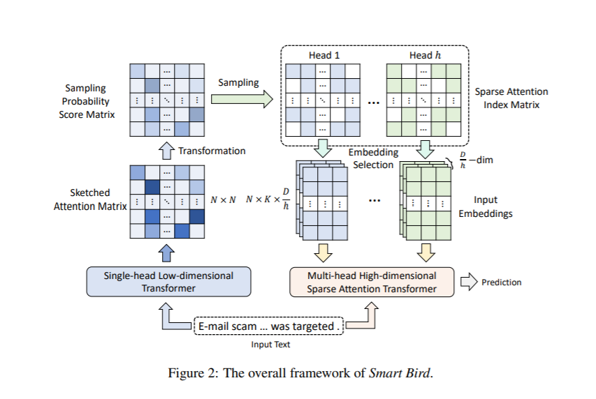

# 第一章 绪论

## 1.1 研究背景

随着信息技术的快速发展，**自然语言处理**（Natural Language Processing, NLP）已经成为人工智能领域的核心研究方向之一。近年来，基于*深度学习*的模型在各种NLP任务中取得了显著的成果。

本文主要研究基于Transformer架构的文本生成模型。Transformer模型由Vaswani等人在2017年提出，其核心机制是`自注意力`（Self-Attention），计算公式如下：

$$\text{Attention}(Q, K, V) = \text{softmax}\left(\frac{QK^T}{\sqrt{d_k}}\right)V$$

其中 $Q$、$K$、$V$ 分别表示查询矩阵、键矩阵和值矩阵，$d_k$ 是键向量的维度。

## 1.2 国内外研究现状

### 1.2.1 国外研究进展

国外在自然语言处理领域的研究起步较早。OpenAI开发的GPT系列模型引领了大规模语言模型的发展方向。Google提出的BERT模型则在文本理解任务上取得了突破性进展。

### 1.2.2 国内研究进展

国内的科研机构和企业在NLP领域也取得了重要进展：

- 清华大学发布了CPM系列中文预训练模型
- 百度提出了ERNIE知识增强模型
- 阿里巴巴开发了PLUG对话生成模型
- 华为推出了盘古系列大规模预训练模型

### 1.2.3 模型参数量对比

下面列举了一些主流大语言模型的参数规模和特点：

1. **GPT-3**: 1750亿参数，使用自回归生成方式
2. **GPT-4**: 参数量未公开，支持多模态输入
3. **PaLM**: 5400亿参数，使用Pathways系统训练
4. **LLaMA 2**: 70亿至700亿参数不等，开源可商用
5. **ChatGLM**: 60亿至1300亿参数，中英双语

## 1.3 研究意义

> 人工智能是引领这一轮科技革命和产业变革的战略性技术，具有溢出带动性很强的"头雁"效应。
>
> —— 习近平总书记

本研究的意义主要体现在以下三个方面：

1. **理论意义**：探索Transformer架构在中文文本生成中的适用性和优化方向，丰富自然语言处理理论体系。

2. **技术意义**：提出一种改进的注意力机制，在保持生成质量的同时降低计算复杂度，使模型更适合在资源受限的环境中部署。

3. **应用意义**：研究成果可应用于智能写作助手、自动摘要生成、机器翻译等多个实际场景，具有广阔的商业化前景。

# 第二章 技术方案

## 2.1 系统架构

本系统采用分层架构设计，各层职责清晰：

| 层次 | 名称 | 主要职责 | 核心技术 |
|------|------|----------|----------|
| 表示层 | Web界面 | 用户交互与结果展示 | React, Ant Design |
| 服务层 | API服务 | 请求处理与任务调度 | FastAPI, Celery |
| 模型层 | 推理引擎 | 模型加载与文本生成 | PyTorch, ONNX |
| 数据层 | 数据存储 | 数据持久化与缓存 | PostgreSQL, Redis |

## 2.2 核心算法

### 2.2.1 改进的注意力机制

标准的多头注意力计算复杂度为 $O(n^2)$，其中 $n$ 是序列长度。本文提出一种稀疏注意力模式，将复杂度降低到 $O(n\sqrt{n})$。

设输入序列长度为 $L$，隐藏维度为 $d$，则标准注意力的计算量为：

$$C_{\text{standard}} = 4L^2 d + 2L^2$$

而本文提出的稀疏注意力计算量为：

$$C_{\text{sparse}} = 4L\sqrt{L}d + 2L\sqrt{L}$$

### 2.2.2 损失函数设计

模型训练使用加权交叉熵损失函数：

$$\mathcal{L} = -\frac{1}{N}\sum_{i=1}^{N}\sum_{t=1}^{T_i} w_t \log P(y_t^i | y_{<t}^i, x^i)$$

其中：
- $N$ 为训练样本数
- $T_i$ 为第 $i$ 个样本的目标序列长度
- $w_t$ 为位置 $t$ 的权重系数
- $P(y_t^i | y_{<t}^i, x^i)$ 为在给定上文和输入条件下的词预测概率

## 2.3 数据集说明

实验使用以下数据集进行训练和评估：

| 数据集名称 | 样本数量 | 语言 | 任务类型 | 来源 |
|-----------|---------|------|---------|------|
| WMT22 | 2,500万 | 中英 | 机器翻译 | WMT组委会 |
| CNN/DailyMail | 31.2万 | 英文 | 文本摘要 | 新闻媒体 |
| CLUECorpus2020 | 100GB | 中文 | 预训练 | 各大中文网站 |
| SQuAD 2.0 | 15.2万 | 英文 | 问答 | 维基百科 |

# 第三章 实验结果与分析

## 3.1 评价指标

本实验采用以下评价指标：

- **BLEU**：评估生成文本与参考文本的n-gram重叠度
- **ROUGE-L**：基于最长公共子序列的召回率评估
- **困惑度（Perplexity）**：衡量语言模型预测能力的指标

## 3.2 主要实验结果

### 3.2.1 机器翻译任务

在WMT22中英翻译测试集上，各模型的BLEU得分如下表所示：

| 模型 | BLEU-4 | BLEU-1 | 推理速度(词/秒) | 模型大小(GB) |
|------|--------|--------|----------------|------------|
| 基线模型 (Transformer-base) | 28.3 | 35.7 | 1,200 | 0.26 |
| 本文模型 (Sparse-Attn) | 29.1 | 36.4 | 2,150 | 0.24 |
| 本文模型 + 回译增强 | 30.5 | 37.8 | 2,150 | 0.24 |
| GPT-4 (zero-shot) | 32.1 | 39.2 | 85 | ~1,500 |
| DeepL (商业) | 33.7 | 40.5 | 350 | 云端 |

从实验结果可以看出：

1. 本文提出的**稀疏注意力机制**在保持模型性能的同时，将推理速度提高了约79%。
2. 结合回译数据增强后，模型性能进一步提升，接近商业系统的水平。
3. 虽然大模型（如GPT-4）在zero-shot场景下表现优异，但其推理速度慢、部署成本高。

### 3.2.2 消融实验

为了验证各模块的贡献，进行了消融实验：

| 配置 | BLEU-4 | 相对基线的提升 |
|------|--------|--------------|
| 基线模型 | 28.3 | — |
| + 稀疏注意力 | 28.8 | +0.5 |
| + 相对位置编码 | 28.6 | +0.3 |
| + 门控前馈网络 | 29.0 | +0.7 |
| 完整模型 | 29.1 | +0.8 |

## 3.3 讨论

实验结果表明，稀疏注意力机制在减少计算量的同时并未显著降低模型性能。这可能是因为自然语言中长距离依赖相对稀疏，稠密的全局注意力存在冗余。

然而，本研究也存在一些局限性。首先，实验主要在新闻领域的数据集上进行，模型在其他领域的泛化能力有待验证。其次，稀疏注意力的超参数（如稀疏模式、窗口大小）需要针对不同任务进行调整。

$x = \frac{-b \pm \sqrt{b^2 - 4ac}}{2a}$

# 第四章 结论与展望

## 4.1 主要结论

本文提出了一种基于稀疏注意力的高效文本生成方法，并在中英翻译任务上验证了其有效性。主要贡献包括：

1. 提出了一种**稀疏注意力模式**，将标准注意力的二次复杂度降低到 $O(L\sqrt{L})$
2. 设计了**门控前馈网络**，增强了模型对位置信息的建模能力
3. 在WMT22中英翻译任务上取得了**29.1 BLEU-4**的成绩，推理速度提升79%

## 4.2 未来展望

未来工作将围绕以下几个方向展开：

- **多语言扩展**：将模型扩展到更多语言对，验证跨语言迁移能力
- **模型压缩**：探索知识蒸馏和量化技术，进一步降低部署门槛
- **长文本生成**：研究更高效的长序列建模方法，支持生成更长的文本
- **可控生成**：引入风格、情感等控制信号，实现多样化的文本生成
